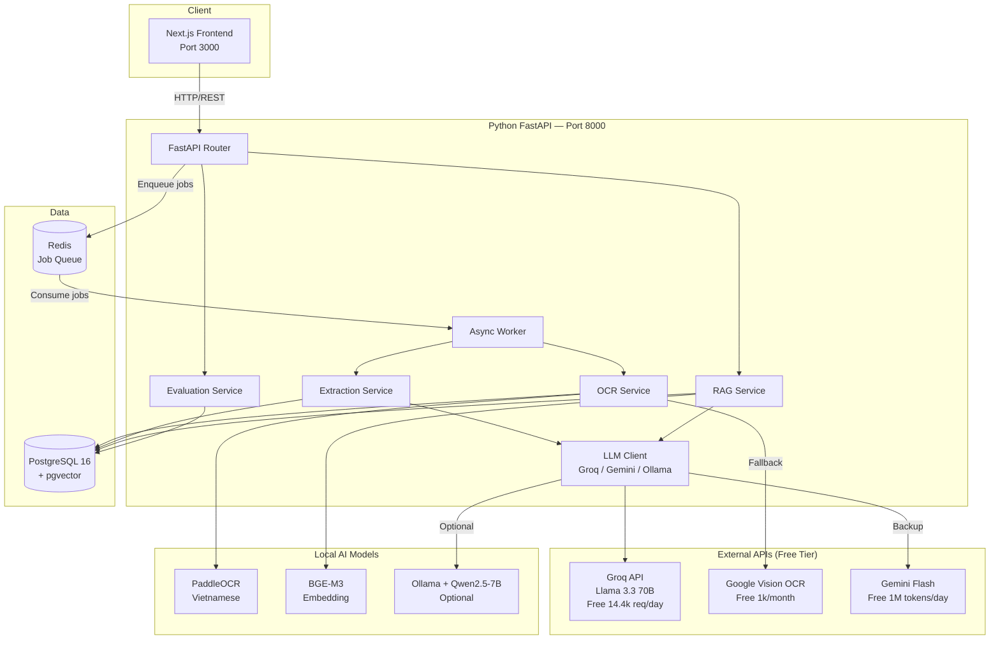
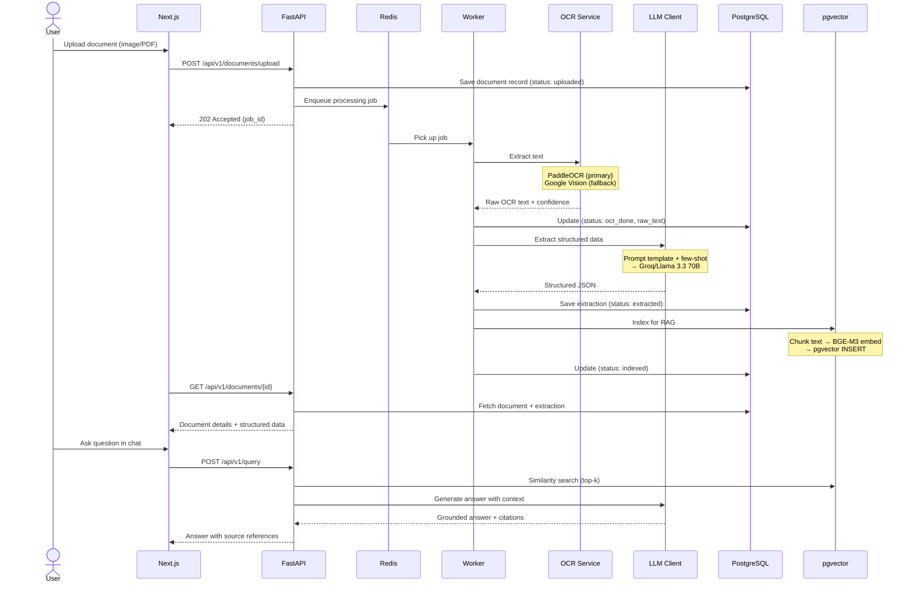
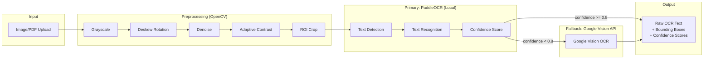
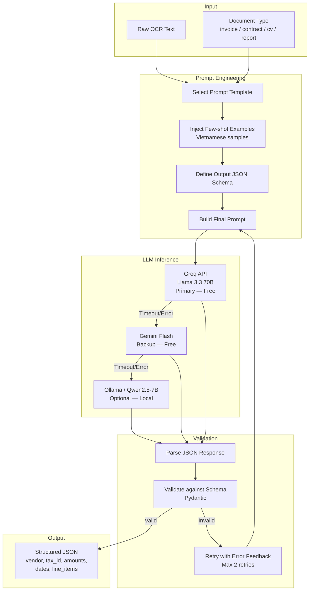
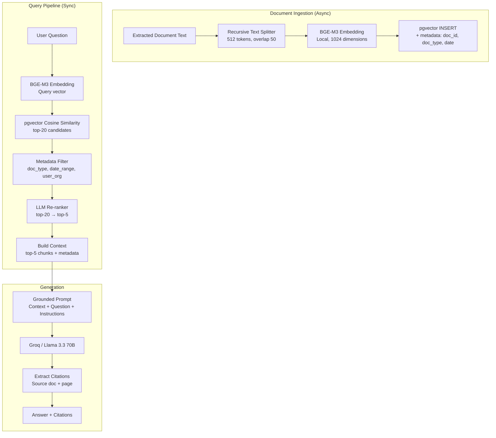
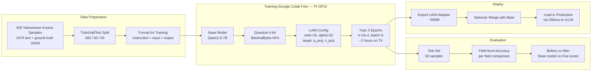
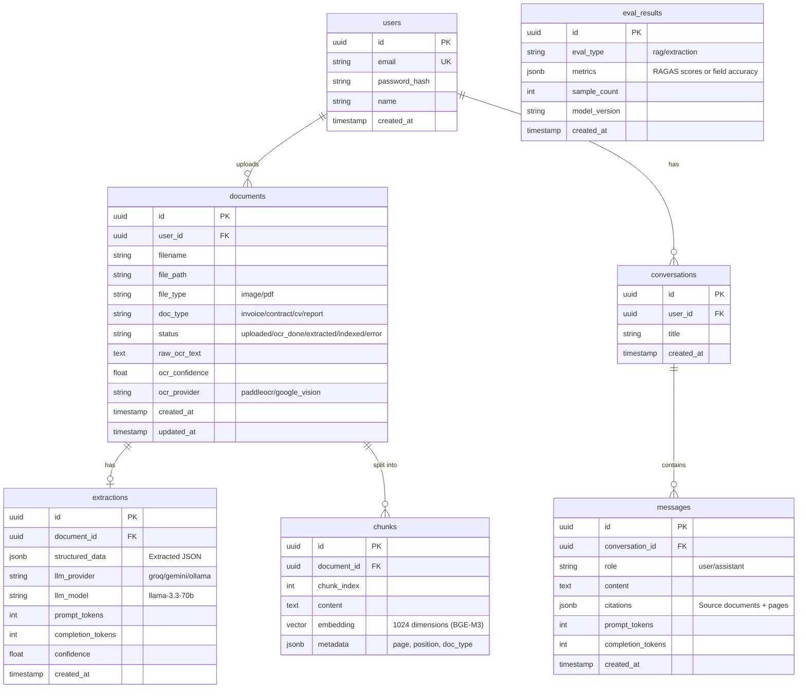
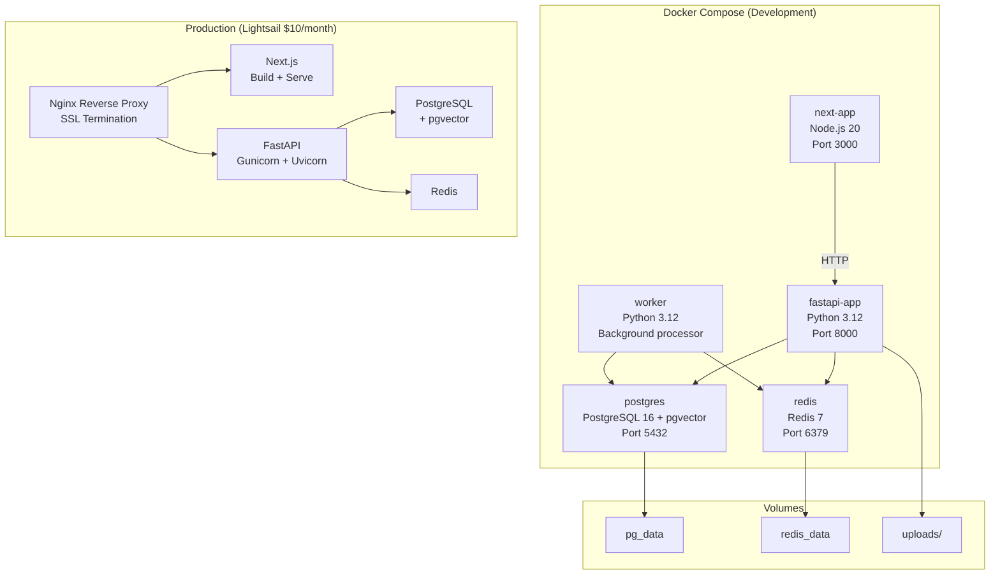
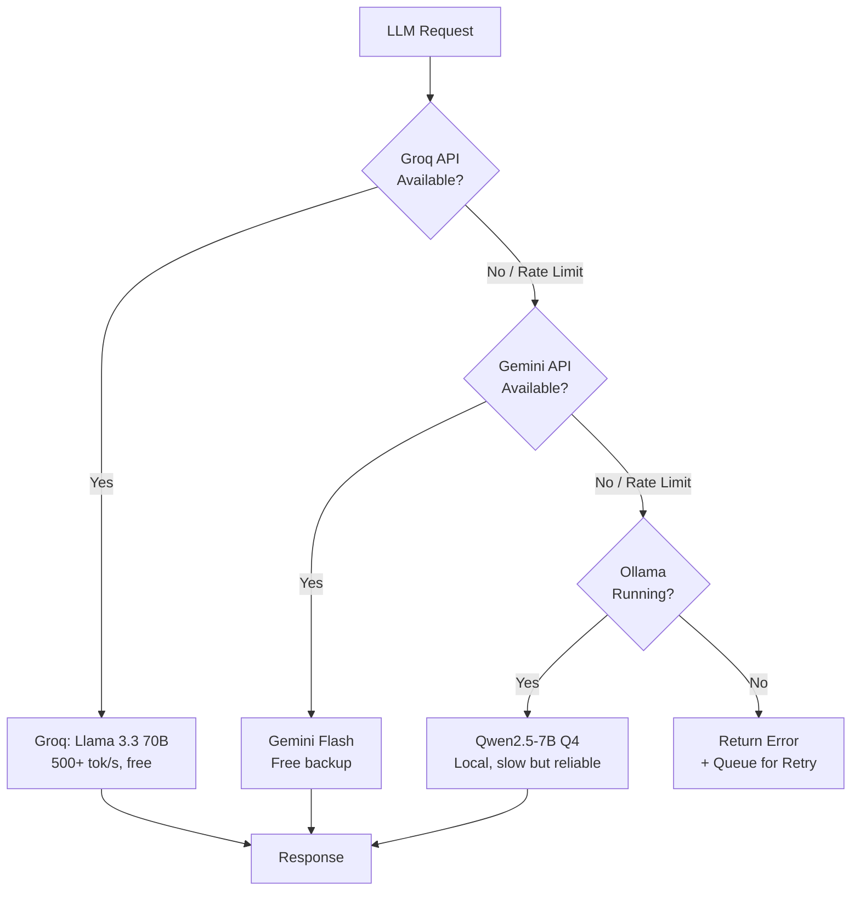

# AI Document Hub — System Design

> Production-ready architecture for intelligent document processing with OCR, LLM extraction, RAG Q&A, fine-tuning, and evaluation.

---

## 1. Architecture Overview



---

## 2. Document Processing Flow (End-to-End)



---

## 3. OCR Pipeline



### OCR Provider Comparison

| Feature | PaddleOCR (Local) | Google Vision (API) |
|---------|-------------------|---------------------|
| Cost | Free | Free 1k/month |
| Vietnamese | Good | Excellent |
| Speed | ~1-3s/page | ~1-2s/page |
| Handwriting | Limited | Good |
| Offline | Yes | No |
| Strategy | **Primary** — always try first | **Fallback** — complex/low-confidence docs |

---

## 4. LLM Extraction Pipeline



### Prompt Template Strategy

```
System: You are a Vietnamese document extraction expert.
Extract ONLY information present in the text.
If a field is not found, return null.
Output format: JSON matching the schema below.

Schema: {json_schema per document type}

Few-shot examples:
- Example 1: [Vietnamese invoice OCR text] → [Expected JSON]
- Example 2: [Vietnamese invoice OCR text] → [Expected JSON]
- Example 3: [Vietnamese invoice OCR text] → [Expected JSON]

User: Extract structured data from this document:
{raw_ocr_text}
```

### Extraction Schema per Document Type

| Document Type | Key Fields |
|---------------|-----------|
| **Invoice** (hóa đơn) | vendor_name, tax_id, invoice_number, date, total_amount, vat_amount, line_items[] |
| **Contract** (hợp đồng) | parties[], effective_date, expiry_date, contract_value, key_terms[] |
| **CV/Resume** | full_name, email, phone, education[], experience[], skills[] |
| **Report** (báo cáo) | title, date, author, summary, key_metrics[] |

---

## 5. RAG Pipeline



### RAG Configuration

| Parameter | Value | Rationale |
|-----------|-------|-----------|
| Chunk size | 512 tokens | Balance between context and retrieval precision |
| Chunk overlap | 50 tokens | Prevent information loss at boundaries |
| Embedding model | BGE-M3 (1024 dim) | Best multilingual model for Vietnamese |
| Top-k retrieval | 20 | Cast wide net for re-ranking |
| Re-rank to | 5 | Focus on most relevant chunks |
| Distance metric | Cosine similarity | Standard for normalized embeddings |
| Temperature | 0.1 | Low creativity, high accuracy for factual Q&A |

### RAG Generation Prompt

```
System: You are a helpful assistant that answers questions based ONLY on the
provided context. If the information is not in the context, say "Tôi không
tìm thấy thông tin này trong tài liệu."

Always cite your sources using [Source: document_name, page X] format.

Context:
{retrieved_chunks with metadata}

User: {user_question}
```

---

## 6. Fine-tuning Pipeline



### Fine-tuning Configuration

| Parameter | Value |
|-----------|-------|
| Base model | Qwen2.5-7B |
| Method | QLoRA (4-bit NF4) |
| LoRA rank | 16 |
| LoRA alpha | 32 |
| Target modules | q_proj, v_proj |
| Learning rate | 2e-4 |
| Batch size | 4 |
| Epochs | 3 |
| Training time | ~2h on T4 GPU |
| Dataset | 500 labeled Vietnamese invoices |
| Adapter size | ~50MB |

### Expected Results

| Metric | Before (Base) | After (Fine-tuned) |
|--------|--------------|-------------------|
| Field accuracy (vendor_name) | ~85% | ~95% |
| Field accuracy (tax_id) | ~80% | ~96% |
| Field accuracy (total_amount) | ~88% | ~94% |
| Field accuracy (line_items) | ~70% | ~88% |
| **Average** | **~81%** | **~93%** |

---

## 7. Evaluation Pipeline

```mermaid
flowchart TB
    subgraph RAG_Eval["RAG Evaluation (RAGAS)"]
        QA_SET[200 Q&A Test Pairs<br/>question + ground_truth + context]
        RAGAS[RAGAS Framework]
        F[Faithfulness<br/>Answer grounded in context?]
        AR[Answer Relevancy<br/>Answer relevant to question?]
        CP[Context Precision<br/>Retrieved context relevant?]
        CR[Context Recall<br/>Missing important context?]
        RAGAS_SCORE[RAGAS Scores<br/>Target: avg >= 0.80]
    end

    subgraph Extract_Eval["Extraction Evaluation"]
        INV_SET[100 Labeled Invoices<br/>OCR text + ground truth JSON]
        EXTRACT[Run Extraction Pipeline]
        FIELD_CMP[Field-by-field Comparison]
        EXACT[Exact Match Rate<br/>All fields correct?]
        FIELD_ACC[Per-field Accuracy<br/>vendor, tax_id, total, date, items]
        EXTRACT_SCORE[Extraction Scores<br/>Target: avg >= 90%]
    end

    subgraph Dashboard["Metrics Dashboard"]
        API_METRICS[/api/v1/eval/summary]
        CHART_RAG[RAGAS Radar Chart]
        CHART_EXT[Extraction Accuracy Bar Chart]
        TREND[Accuracy Trend Over Time]
    end

    QA_SET --> RAGAS
    RAGAS --> F & AR & CP & CR
    F & AR & CP & CR --> RAGAS_SCORE

    INV_SET --> EXTRACT --> FIELD_CMP
    FIELD_CMP --> EXACT & FIELD_ACC
    EXACT & FIELD_ACC --> EXTRACT_SCORE

    RAGAS_SCORE --> API_METRICS
    EXTRACT_SCORE --> API_METRICS
    API_METRICS --> CHART_RAG & CHART_EXT & TREND
```

### Target Metrics

| Category | Metric | Target |
|----------|--------|--------|
| RAG | Faithfulness | >= 0.85 |
| RAG | Answer Relevancy | >= 0.80 |
| RAG | Context Precision | >= 0.75 |
| RAG | Context Recall | >= 0.80 |
| RAG | **Average RAGAS** | **>= 0.80** |
| Extraction | Vendor name accuracy | >= 95% |
| Extraction | Tax ID accuracy | >= 96% |
| Extraction | Total amount accuracy | >= 94% |
| Extraction | Line items accuracy | >= 88% |
| Extraction | **Average field accuracy** | **>= 93%** |

---

## 8. Database Schema



---

## 9. Deployment Architecture



### Docker Compose Services

| Service | Image | RAM | Port |
|---------|-------|-----|------|
| next-app | node:20-alpine | ~300MB | 3000 |
| fastapi-app | python:3.12-slim | ~150MB | 8000 |
| worker | python:3.12-slim | ~1.5GB (PaddleOCR + BGE-M3) | — |
| postgres | pgvector/pgvector:pg16 | ~200MB | 5432 |
| redis | redis:7-alpine | ~50MB | 6379 |
| **Total** | | **~2.2GB** | |

> Worker loads PaddleOCR + BGE-M3 models. On 16GB RAM machine, still leaves ~13GB headroom.

---

## 10. API Endpoints

| Method | Endpoint | Description |
|--------|----------|-------------|
| POST | `/api/v1/documents/upload` | Upload document, start async processing |
| GET | `/api/v1/documents` | List user's documents |
| GET | `/api/v1/documents/{id}` | Get document details + extraction |
| POST | `/api/v1/ocr/extract` | Sync OCR extraction (for testing) |
| POST | `/api/v1/extract` | Sync LLM extraction (for testing) |
| POST | `/api/v1/query` | RAG Q&A query |
| GET | `/api/v1/conversations` | List conversations |
| GET | `/api/v1/conversations/{id}` | Get conversation messages |
| GET | `/api/v1/eval/summary` | Latest evaluation metrics |
| POST | `/api/v1/eval/run` | Trigger evaluation pipeline |

---

## 11. LLM Provider Strategy



### Provider Comparison

| Provider | Model | Speed | Cost | Availability |
|----------|-------|-------|------|-------------|
| **Groq** | Llama 3.3 70B | 500+ tok/s | Free (14.4k req/day) | API, needs internet |
| **Gemini** | Gemini Flash | ~200 tok/s | Free (1M tok/day) | API, needs internet |
| **Ollama** | Qwen2.5-7B Q4 | ~30 tok/s | Free (local) | Local, needs 6GB RAM |

**Strategy:** Groq first (fastest + free), Gemini backup (also free), Ollama offline fallback.

---

## 12. Security Considerations

| Risk | Mitigation |
|------|-----------|
| Prompt Injection | Input sanitization, system prompt isolation, output validation |
| File Upload Attack | File type validation, max size limit (20MB), virus scan |
| API Key Exposure | Environment variables, never commit `.env`, Docker secrets in prod |
| Data Privacy | Per-user document isolation, no cross-user RAG retrieval |
| Rate Limiting | FastAPI rate limiter, respect Groq/Google API limits |
| SQL Injection | SQLAlchemy ORM, parameterized queries |

---

## 13. Monitoring & Observability

| Metric | Tool | Purpose |
|--------|------|---------|
| API Latency (P50/P95/P99) | FastAPI middleware + logging | Performance tracking |
| OCR Processing Time | Custom metrics | Pipeline bottleneck detection |
| LLM Token Usage | Per-request logging | Cost tracking |
| RAG Retrieval Quality | RAGAS periodic eval | Accuracy monitoring |
| Extraction Accuracy | Field-level eval | Model drift detection |
| Error Rate | Sentry / structured logging | Reliability |
| Queue Depth | Redis monitoring | Processing backlog |
